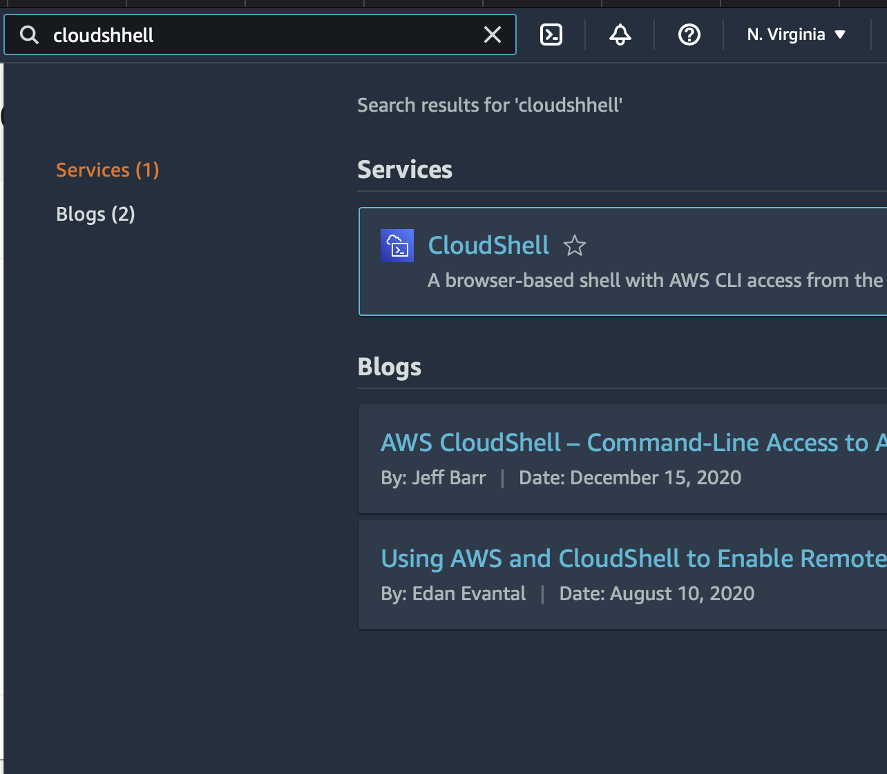

# Lab 3 - Batch Transcription using Python SDK

You can use SDKs for both batch and streaming transcriptions. If you're transcribing a media file located in an Amazon S3 bucket, you're performing a batch transcription. If you're transcribing a real-time stream of audio data, you're performing a streaming transcription.

::alert[For a list of the programming languages you can use with Amazon Transcribe, see [Supported programming languages](https://docs.aws.amazon.com/transcribe/latest/dg/supported-languages.html#supported-sdks). To view supported media formats and other media requirements and constraints, see [Data input and output](https://docs.aws.amazon.com/transcribe/latest/dg/how-input.html)]

You can create batch transcriptions using the URI of a media file located in an Amazon S3 bucket. If you're unsure how to create an Amazon S3 bucket or upload your file, refer to [Create your first S3 bucket](https://docs.aws.amazon.com/AmazonS3/latest/userguide/creating-bucket.html) and [Upload an object to your bucket](https://docs.aws.amazon.com/AmazonS3/latest/userguide/uploading-an-object-bucket.html).

1. You will use 'CloudShell' to execute Python code. Search for CloudShell in AWS Console as shown below:

    

2. Copy the following code and save as a python file `batch-transcribe.py` on your local machine:

```python
import time
import boto3

def transcribe_file(job_name, file_uri, transcribe_client):
    transcribe_client.start_transcription_job(
        TranscriptionJobName = job_name,
        Media = {
            'MediaFileUri': file_uri
        },
        MediaFormat = 'mp3',
        LanguageCode = 'en-US'
    )

    max_tries = 60
    while max_tries > 0:
        max_tries -= 1
        job = transcribe_client.get_transcription_job(TranscriptionJobName = job_name)
        job_status = job['TranscriptionJob']['TranscriptionJobStatus']
        if job_status in ['COMPLETED', 'FAILED']:
            print(f"Job {job_name} is {job_status}.")
            if job_status == 'COMPLETED':
                print(
                    f"Download the transcript from\n"
                    f"\t{job['TranscriptionJob']['Transcript']['TranscriptFileUri']}.")
            break
        else:
            print(f"Waiting for {job_name}. Current status is {job_status}.")
        time.sleep(10)


def main():
    transcribe_client = boto3.client('transcribe', region_name = 'us-east-1')
    file_uri = 's3://DOC-EXAMPLE-BUCKET/my-input-files/demo-call.mp3'
    transcribe_file('Example-job', file_uri, transcribe_client)


if __name__ == '__main__':
    main()
```
NOTE: 
3. Upload the demo audio file to S3 bucket.

4. Replace the path with your path to the audio file, point to the right AWS region in the python code. 

    ```python
        transcribe_client = boto3.client('transcribe', region_name = 'us-east-1')
        file_uri = 's3://DOC-EXAMPLE-BUCKET/my-input-files/demo-call.mp3'
    ```
6. Upload the python file as shown below:
    

7. You should find the uploaded file in the root of cloudshell-user. Then, execute the code `python batch-transcribe.py` as shown below, you should see the path to the transcribed text after the execution.
    

8. Now, copy the ouput of the command line execution which is the path to the output of the Transcribe API response. You can copy that output URL address to the browser to download the json response.


::alert[You can create streaming transcriptions using a streamed media file or a live media stream. Note that the standard AWS SDK for Python (Boto3) is not supported for Amazon Transcribe streaming. To start a streaming transcription using Python, use this [async Python SDK for Amazon Transcribe](https://github.com/awslabs/amazon-transcribe-streaming-sdk).]
